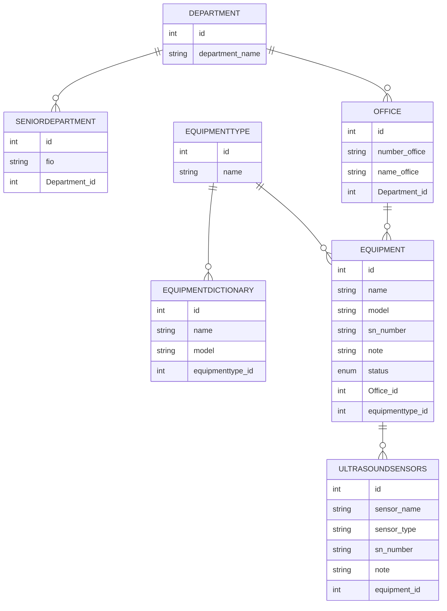
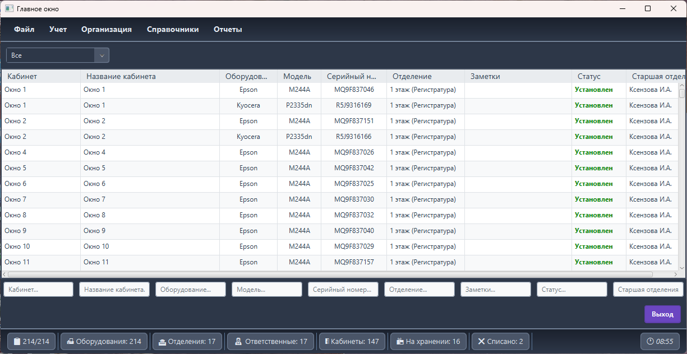

# 🧰 EquipmentApplication

### 🧾 Project Description
**EquipmentApplication** is a desktop JavaFX program for managing equipment in an organization.  
It helps record where each item is installed, who is responsible for it, and its current status (installed, stored, or disposed).

---

### 🎯 Project Goal
The main goal is to make equipment registration and tracking easier.

You can:
- 📍 View all equipment and its location  
- 👤 Assign responsible persons  
- 🔄 Change statuses  
- 🧾 Add, edit, or delete records  
- 🔍 Search through the list

---

### ⚙️ Technologies Used
- ☕ **Java 17+**
- 🎨 **JavaFX** — user interface
- 🗄️ **MySQL** — database
- 🧩 **DAO / DTO pattern**
- ⚙️ **Maven / Build Artifacts**

---

### 📁 Project Structure
```text
src/java/com/example/equipmentapplication/
├── config/
│ └── Config.java
│
├── dao/
│ ├── DepartmentDAO.java
│ ├── EquipmentDAO.java
│ ├── EquipmentDictionaryDAO.java
│ ├── EquipmentTypeDAO.java
│ ├── OfficeDAO.java
│ ├── SeniorDepartmentDAO.java
│ └── UltrasoundSensorDAO.java
│
├── dto/
│ ├── Department.java
│ ├── Equipment.java
│ ├── EquipmentDictionary.java
│ ├── EquipmentType.java
│ ├── Office.java
│ ├── SeniorDepartment.java
│ └── UltrasoundSensor.java
│
├── util/
│ ├── AlertUtils.java
│ └── WindowUtils.java
│
├── window/
│ ├── DepartmentWindow.java
│ ├── EquipmentDictionaryWindow.java
│ ├── EquipmentTypeWindow.java
│ ├── EquipmentWindow.java
│ ├── LoadingWindow.java
│ ├── MainWindow.java
│ ├── OfficeWindow.java
│ ├── SeniorDepartmentWindow.java
│ └── UltrasoundSensorWindow.java
│
├── DatabaseHelper.java
├── FieldValidator.java
└── HelloApplication.java

src/java/resources/
```
---

### 🧠 Database Diagram (ER Model)

---
🖼️ Interface Example
(insert your screenshot here)

---
👨‍💻 Author
Author: Evgeny Dantsov
License: MIT
Project type: Work-use application
